# Cas 1

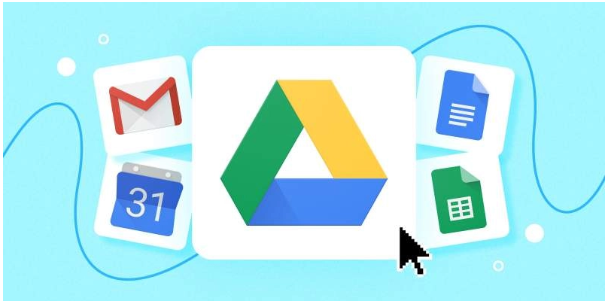

### **Index**
  
* Perquè penseu que aquesta és una bona solució al nostre problema.3
* El pressupost mensual i anual de la despesa del servei a contractar.	
* Guia de creació de les unitats compartides BACKUP i DOCUMENTS on es vegin els permisos assignats a cada tipus d’usuari/a.	
* Guia d’instal·lació d’adreces directes als escriptoris dels dos tipus d’usuaris: Administrador/a i usuari/a.	
* Exemples d’ús de fer un backup per part de l’administrador/a.	
* Exemples d’ús de consultar un document per part de l’usuari/a.	
* Comproveu si un usuari/a pot eliminar sense voler algun document.	

## **Perquè penseu que aquesta és una bona solució al nostre problema.**

Perque google drive es un gestors d’arxius online bastant accessible des de totes les plataformes.

Amb Google Drive, cada fitxer s'emmagatzema de manera segura independentment del que li passi al dispositiu (Smartphone, tablet o ordinador), ja que els fitxers s'emmagatzemen en els propis servidors de Google, permetent protegir tota la nostra informació.

Ademes de que te almacenatge adequat per als nostres requeriments,es un gestors d’arxius Documental “ens permeten modificar/editar els nostres arxius”

Si bé els fitxers que pugen a Google Drive poden ser compartits amb altres usuaris, és important destacar que els mateixos són d'índole privada fins que el mateix usuari vol compartir-los.

ALGUNES CARACTERÍSTIQUES:

* Emmagatzematge gratuït i pagament
* Multi-plataforma
* Suporta i guarda qualsevol fitxer
* Privadesa
* Seguretat i protecció
* Cerca potent
* Emmagatzematge per a Chromebook
* Treballar sense connexió
* Escaneig de documents

Amb aquesta solució tindrem les nostres còpies de seguretat en perfecte estat.

## El pressupost mensual i anual de la despesa del servei a contractar.

Amb lo Pla anual de Google Drive Premium ens ahorrem 19,89€ a si pagasem sol mensualment.

## Guia de creació de les unitats compartides BACKUP i DOCUMENTS on es vegin els permisos assignats a cada tipus d’usuari/a.

En aquesta imatge podem observar com podem donar permisos als altres usuaris en aquest cas sols l’administrador té accés per a editar lo document mentres que l’altre usuari sols pot veure.

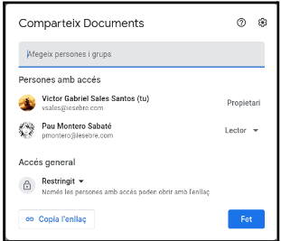

En qualsevol moment l’administrador pot modificar els permisos dels ALTRES USUARIS en aquest cas 

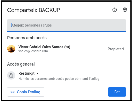

com es la carpeta de DOCUMENTS els usuaris normals només  tindrien que tindre els permisos de lectura.
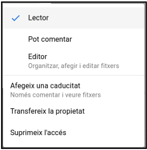

En aquesta carpeta que es la de BACKUP sols té accés l’administrador.

## Guia d’instal·lació d’adreces directes als escriptoris dels dos tipus d’usuaris: Administrador/a i usuari/a.
* Obrir Paràmetres.

 

* Buscar Comptes en Linea

 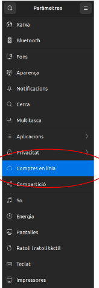
 
 
 *Entrem a l'opció de google
 
 
 
 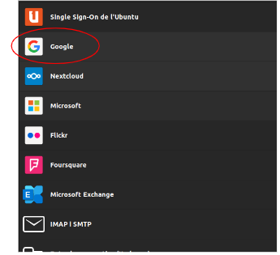
 
 * Iniciem Sessió amb el compte que volem tenir accés des de l'escriptori.

 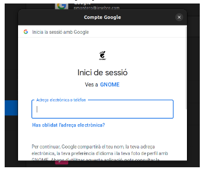

 
 
 * Un cop els anteriors passos fets el nostre google drive apareix en els nostres fitxers.

 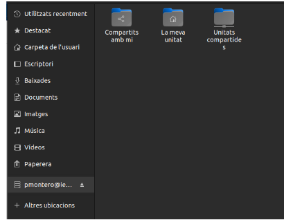

 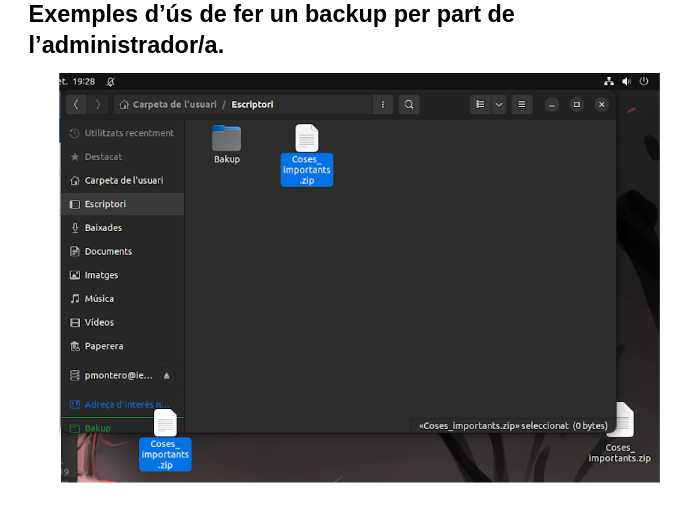
 
 
 
 
 
 
  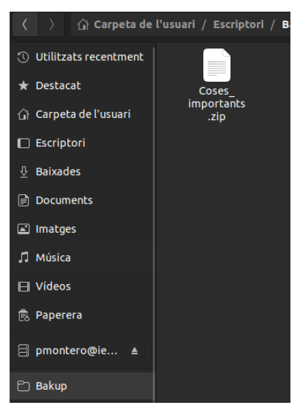
  
  
  
  
  
  
  
  
   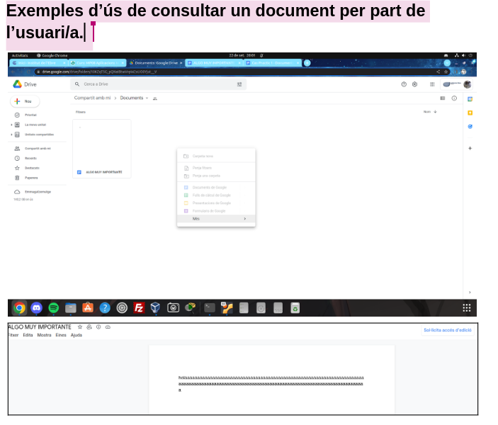
   
   
   
   
   
   
   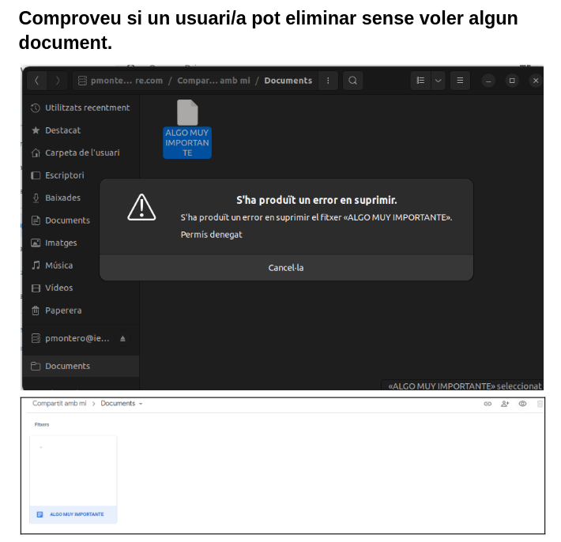
